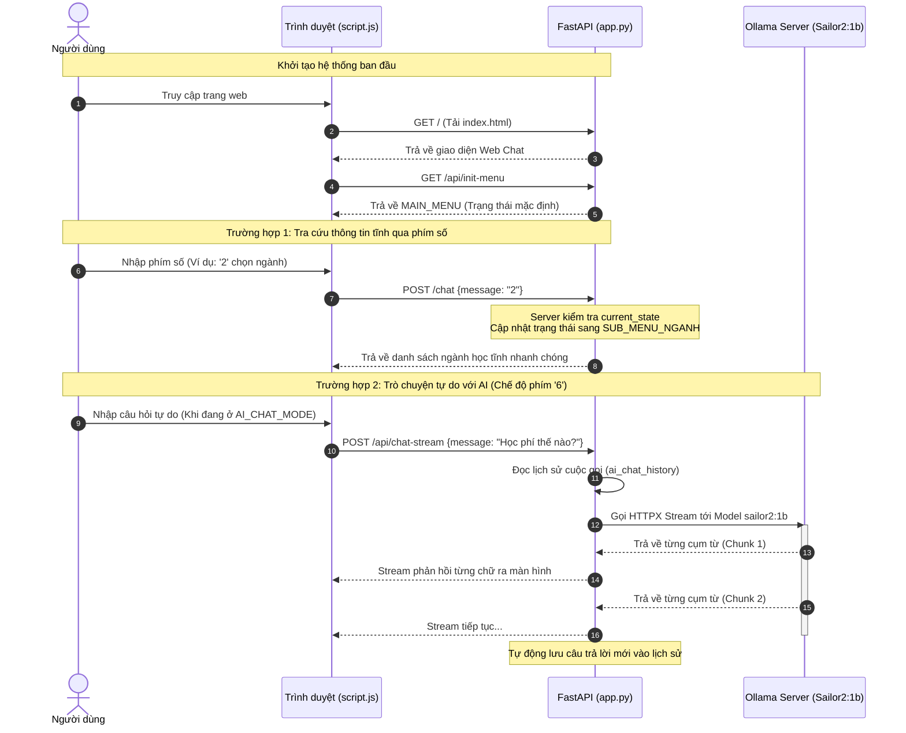

 **VJU InfoBot** là hệ thống Chatbot tự động hỗ trợ tư vấn tuyển sinh, thông tin ngành học, học phí và chính sách học bổng của Trường Đại học Việt Nhật (VJU) - ĐHQGHN trong năm 2026. 

Ứng dụng kết hợp giữa mô hình quản lý trạng thái tĩnh và trí tuệ nhân tạo (LLM) cục bộ, mang lại trải nghiệm tra cứu thông tin nhanh chóng và trò chuyện tự nhiên với người dùng.


## ✨ Tính năng chính

* **⚡ Menu tương tác thông minh:** Điều hướng phân cấp qua các phím số/chữ (`1-7`, `0`, `C`) để tra cứu thông tin tĩnh cực nhanh mà không cần chờ đợi.
* **📚 Kho dữ liệu tuyển sinh 2026:** Cập nhật chi tiết 9 ngành đào tạo đại học, 6 phương thức xét tuyển, học phí toàn khóa và các gói học bổng doanh nghiệp lớn (Zensho, Mitsubishi).
* **🧠 Chế độ AI Chat (Sailor2:7b):** Tích hợp mô hình ngôn ngữ lớn qua Ollama để trả lời tự do, thân thiện, ngắn gọn bằng tiếng Việt và tự động lưu trữ ngữ cảnh (`ai_chat_history`).
* **🌊 Truyền phát dữ liệu (Streaming Response):** Endpoint chuyên biệt giúp hiển thị câu trả lời từ AI theo thời gian thực (stream từng từ) mượt mà, không bị trễ.
* **🧹 Xử lý ngôn ngữ linh hoạt:** Tích hợp bộ lọc loại bỏ dấu tiếng Việt giúp tối ưu hóa việc nhận diện lệnh từ người dùng.

## 📸 Giao diện ứng dụng
Hệ thống bao gồm giao diện Web trực quan với các tệp tài nguyên:
* `index.html`: Giao diện hiển thị khung chat và menu tương tác.
* `style.css` & `script.js`: Xử lý giao diện động và hiệu ứng hiệu năng cao.
* `logo-vju-red.png` & `ca.jpg`: Bộ nhận diện thương hiệu và hình ảnh hiển thị trên bot.

## 🛠️ Công nghệ sử dụng

* **Backend Framework:** FastAPI (Python)
* **Web Server:** Uvicorn
* **HTTP Client:** HTTPX (Xử lý các yêu cầu bất đồng bộ đến mô hình AI)
* **Data Validation:** Pydantic
* **AI Platform:** Ollama (Model mặc định: `sailor2:7b`)

## 📂 Cấu trúc mã nguồn chính
Cấu trúc cây thư mục trong file `VJU-InfoBot-ver2-main.zip`:
```text
VJU-InfoBot-ver2-main/
└── ACTIVE/
    ├── app.py             # File thực thi Backend chính (FastAPI)
    ├── index.html         # Giao diện người dùng
    ├── script.js          # Logic điều hướng và gửi nhận API phía Client
    ├── style.css          # Định dạng giao diện Web Chat
    ├── ca.jpg             # Hình ảnh tài nguyên
    └── logo-vju-red.png   # Logo Trường Đại học Việt Nhật
```
---

## 🗺️ SƠ ĐỒ UML VẬN HÀNH (SEQUENCE DIAGRAM)

<small>

Sơ đồ tuần tự dưới đây minh họa luồng đi của dữ liệu khi người dùng nhắn tin, từ việc kiểm tra trạng thái menu tĩnh cho đến khi kích hoạt luồng xử lý AI Stream từ Ollama:


-------------
## 📦 HƯỚNG DẪN CÀI ĐẶT

<small>

### Yêu cầu hệ thống
* Python 3.10 trở lên.
* Đã cài đặt **Ollama** trên máy tính.

### Các bước thực hiện
**1. Tải mô hình AI:**
Mở Terminal/Command Prompt và chạy lệnh sau để tải model `sailor2:1b`:
```bash
ollama pull sailor2:1b
```
🚀 CÁCH CHẠY ỨNG DỤNG
<small>

Sau khi đã chuẩn bị xong môi trường và mô hình AI, bạn tiến hành khởi chạy ứng dụng theo các bước sau:

1. Đảm bảo bạn đang đứng ở thư mục chứa mã nguồn chính (`ACTIVE`).
2. Chạy câu lệnh python dưới đây để khởi động Web Server Uvicorn:
```bash
   python app.py
Mở trình duyệt web bất kỳ và truy cập vào địa chỉ cục bộ:👉 http://127.0.0.1:8000  
```
