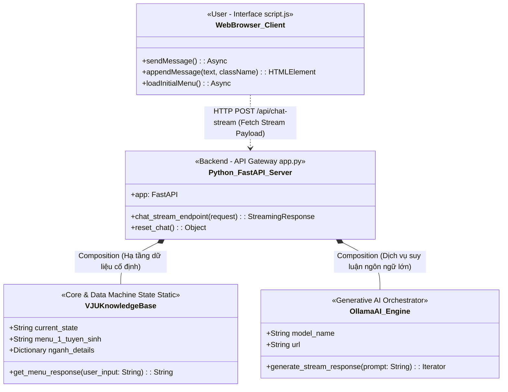

 **VJU InfoBot** là hệ thống Chatbot tự động hỗ trợ tư vấn tuyển sinh, thông tin ngành học, học phí và chính sách học bổng của Trường Đại học Việt Nhật (VJU) - ĐHQGHN trong năm 2026. 

Ứng dụng kết hợp giữa mô hình quản lý trạng thái tĩnh và trí tuệ nhân tạo (LLM) cục bộ, mang lại trải nghiệm tra cứu thông tin nhanh chóng và trò chuyện tự nhiên với người dùng.


## ✨ Tính năng chính

* **⚡ Menu tương tác thông minh:** Điều hướng phân cấp qua các phím số/chữ (`1-7`, `0`, `C`) để tra cứu thông tin tĩnh cực nhanh mà không cần chờ đợi.
* **📚 Kho dữ liệu tuyển sinh 2026:** Cập nhật chi tiết 9 ngành đào tạo đại học, 6 phương thức xét tuyển, học phí toàn khóa và các gói học bổng doanh nghiệp lớn (Zensho, Mitsubishi).
* **🧠 Chế độ AI Chat (Sailor2:7b):** Tích hợp mô hình ngôn ngữ lớn qua Ollama để trả lời tự do, thân thiện, ngắn gọn bằng tiếng Việt và tự động lưu trữ ngữ cảnh (`ai_chat_history`).
* **🌊 Truyền phát dữ liệu (Streaming Response):** Endpoint chuyên biệt giúp hiển thị câu trả lời từ AI theo thời gian thực (stream từng từ) mượt mà, không bị trễ.
* **🧹 Xử lý ngôn ngữ linh hoạt:** Tích hợp bộ lọc loại bỏ dấu tiếng Việt giúp tối ưu hóa việc nhận diện lệnh từ người dùng.

## 📸 Giao diện ứng dụng
Hệ thống bao gồm giao diện Web trực quan với các tệp tài nguyên:
* `index.html`: Giao diện hiển thị khung chat và menu tương tác.
* `style.css` & `script.js`: Xử lý giao diện động và hiệu ứng hiệu năng cao.
* `logo-vju-red.png` & `ca.jpg`: Bộ nhận diện thương hiệu và hình ảnh hiển thị trên bot.

## 🛠️ Công nghệ sử dụng

* **Backend Framework:** FastAPI (Python)
* **Web Server:** Uvicorn
* **HTTP Client:** HTTPX (Xử lý các yêu cầu bất đồng bộ đến mô hình AI)
* **Data Validation:** Pydantic
* **AI Platform:** Ollama (Model mặc định: `sailor2:7b`)

## 📂 Cấu trúc mã nguồn chính
Cấu trúc cây thư mục trong file `VJU-InfoBot-ver2-main.zip`:
```text
VJU-InfoBot-ver2-main/
└── ACTIVE/
    ├── app.py             # File thực thi Backend chính (FastAPI)
    ├── index.html         # Giao diện người dùng
    ├── script.js          # Logic điều hướng và gửi nhận API phía Client
    ├── style.css          # Định dạng giao diện Web Chat
    ├── ca.jpg             # Hình ảnh tài nguyên
    └── logo-vju-red.png   # Logo Trường Đại học Việt Nhật
```
---

---

## 🗺️ SƠ ĐỒ LỚP HỆ THỐNG (CLASS DIAGRAM)

<small>

Dưới đây là cấu trúc thiết kế kiến trúc các lớp thành phần trong mã nguồn hệ thống:


## 🏗️ Phân Tích Các Kỹ Thuật OOP Áp Dụng Trong Dự Án

Hệ thống được module hóa nghiêm ngặt dựa trên tư duy Lập trình hướng đối tượng (OOP), giúp phân tách luồng xử lý riêng biệt, dễ dàng bảo trì và mở rộng dữ liệu.

### 1. Tính Đóng Gói (Encapsulation)
Toàn bộ thuộc tính (dữ liệu) và phương thức (hành vi) được gom cụm chặt chẽ vào các lớp (class) độc lập nhằm che giấu logic xử lý nội bộ với bên ngoài:

* Lớp VJUKnowledgeBase:
    * Dữ liệu đóng gói: Quản lý toàn bộ dữ liệu tuyển sinh tĩnh và biến trạng thái current_state (Máy trạng thái hữu hạn - FSM).
    * Che giấu logic: Các thành phần bên ngoài không cần biết cấu trúc rẽ nhánh phức tạp ra sao, chỉ tương tác qua một hàm duy nhất: get_menu_response(user_input).
* Lớp OllamaAI_Engine:
    * Dữ liệu đóng gói: Lưu trữ lịch sử hội thoại ai_chat_history, cấu hình endpoint API (url) và tên mô hình AI (model_name).
    * Che giấu logic: Toàn bộ quá trình gọi kết nối HTTP Client bất đồng bộ và xử lý luồng dữ liệu thô (Stream text) được xử lý kín bên trong phương thức generate_stream_response(prompt).

### 2. Tính Trừu Tượng (Abstraction)
* Hệ thống sử dụng lớp OllamaAI_Engine đóng vai trò như một "hộp đen" trừu tượng hóa cho mô hình ngữ lớn (Generative AI LLM).
* Đối với máy chủ FastAPI (app.py), nó hoàn toàn không cần can thiệp hay hiểu về cấu trúc mạng neural của mô hình Sailor2:1b, mà chỉ giao tiếp qua giao diện trừu tượng: Gửi câu hỏi thô, nhận luồng từ ngữ trả về.

### 3. Quan Hệ Giữa Các Đối Tượng (Object Relationships)
Dự án áp dụng chặt chẽ nguyên lý thiết kế hiện đại: Ưu tiên quan hệ chứa trong thay vì lạm dụng kế thừa (Favor composition over inheritance):

* Quan hệ Thành phần (Composition):
    Máy chủ chính Python_FastAPI_Server chứa trực tiếp và quản lý toàn bộ vòng đời của hai thực thể VJUKnowledgeBase và OllamaAI_Engine. Khi máy chủ khởi chạy, các thực thể này được khởi tạo; khi máy chủ tắt, chúng sẽ bị hủy theo.
* Quan hệ Hiệp tác (Association):
    Giữa giao diện người dùng (WebBrowser_Client) và máy chủ (Python_FastAPI_Server) tương tác lỏng với nhau qua giao thức HTTP (API fetch), trao đổi dữ liệu độc lập mà không sở hữu hay can thiệp vào vòng đời của nhau.
-------------
## 📦 HƯỚNG DẪN CÀI ĐẶT

<small>

### Yêu cầu hệ thống
* Python 3.10 trở lên.
* Đã cài đặt **Ollama** trên máy tính.

### Các bước thực hiện
**1. Tải mô hình AI:**
Mở Terminal/Command Prompt và chạy lệnh sau để tải model `sailor2:1b`:
```bash
ollama pull sailor2:1b
```
🚀 CÁCH CHẠY ỨNG DỤNG
<small>

Sau khi đã chuẩn bị xong môi trường và mô hình AI, bạn tiến hành khởi chạy ứng dụng theo các bước sau:

1. Đảm bảo bạn đang đứng ở thư mục chứa mã nguồn chính (`ACTIVE`).
2. Chạy câu lệnh python dưới đây để khởi động Web Server Uvicorn:
```bash
   python app.py
Mở trình duyệt web bất kỳ và truy cập vào địa chỉ cục bộ:👉 http://127.0.0.1:8000  
```
